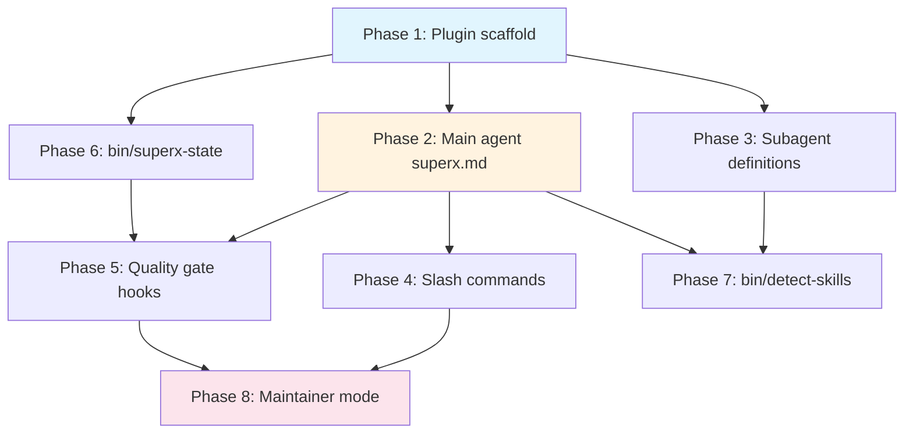

# superx — Implementation Plan

## Context

superx is an autonomous superskill manager plugin for Claude Code. The user's spec describes an orchestration layer that decomposes prompts into sub-projects, spawns specialized agents, enforces quality gates, and maintains state across sessions. This plan maps each spec section to Claude Code's actual plugin primitives (skills, subagents, agent teams, hooks) and identifies where the spec needs adjustment to fit platform constraints.

---

## Key Architecture Decisions

### Platform constraints that shape the design

1. **Subagents cannot spawn subagents.** This is the single biggest constraint. superx must run as the **main session agent** (`claude --agent superx`), so it has direct access to the `Agent()` tool and can spawn all worker subagents itself.

2. **Agent teams are experimental** but provide exactly what section 2.3 needs: parallel workers with shared task lists and inter-agent messaging. The plan uses agent teams as the primary orchestration mechanism, with subagent-based fallback for simpler tasks.

3. **Skills are prompt-based, not code.** The spec's `scripts/*.py` files should be **shell scripts** invoked via `!command` dynamic injection or as `bin/` executables, not Python modules that get imported. Claude Code doesn't run Python as a plugin runtime — it runs shell commands.

4. **No custom keybindings.** Arrow-key cycling (spec 2.2) is not possible. Autonomy levels use slash commands only.

5. **Permission modes map to autonomy levels.** Claude Code's built-in `default` / `acceptEdits` / `auto` / `bypassPermissions` modes align closely with Guided / Checkpoint / Full Auto.

### Architecture overview

```
┌─────────────────────────────────────────────────────────────┐
│  User runs: superx                                          │
│  (wrapper that runs claude --agent superx                   │
│   --dangerously-skip-permissions --plugin-dir <self>)       │
└────────────────────┬────────────────────────────────────────┘
                     │
                     ▼
┌─────────────────────────────────────────────────────────────┐
│  superx main agent (agents/superx.md)                       │
│  ┌────────────────────────────────────────────────────────┐ │
│  │ System prompt: orchestration loop, CTO mindset,        │ │
│  │ skill detection, plan decomposition, quality gates     │ │
│  │ Preloaded skills: superx-conventions, quality-gates    │ │
│  │ Tools: Agent(*), Read, Write, Edit, Bash, Grep, Glob  │ │
│  └────────────────────────────────────────────────────────┘ │
│                        │                                    │
│         ┌──────────────┼──────────────┐                     │
│         ▼              ▼              ▼                     │
│  ┌────────────┐ ┌────────────┐ ┌────────────┐              │
│  │ architect  │ │ coder      │ │ test-runner │  ...more     │
│  │ (subagent) │ │ (subagent) │ │ (subagent)  │              │
│  └────────────┘ └────────────┘ └────────────┘              │
│                                                             │
│  OR for complex parallel work:                              │
│                                                             │
│  ┌──────────────────────────────────────────┐               │
│  │ Agent Team (experimental)                │               │
│  │ Lead: superx main agent                  │               │
│  │ Teammates: coder-1, coder-2, test-runner │               │
│  │ Shared task list + messaging             │               │
│  └──────────────────────────────────────────┘               │
└─────────────────────────────────────────────────────────────┘

State persistence:
  superx-state.json ◄── read/written by main agent + hooks
  CLAUDE.md         ◄── updated at milestones via skill
  .claude/agent-memory/superx/ ◄── persistent memory across sessions
```

---

## Implementation Plan

### Phase 1: Plugin scaffold + main agent

**Files to create:**

```
superx/
├── .claude-plugin/
│   └── plugin.json
├── agents/
│   ├── superx.md              # Main orchestrator agent
│   ├── architect.md           # Task decomposition subagent
│   ├── coder.md               # Implementation subagent
│   ├── test-runner.md         # Test writing/running subagent
│   ├── lint-quality.md        # Lint + static analysis subagent
│   ├── docs-writer.md         # Documentation subagent
│   └── reviewer.md            # PR review subagent
├── skills/
│   └── superx/
│       ├── SKILL.md           # Main skill (for non-agent invocation)
│       └── references/
│           ├── agent-templates.md
│           ├── quality-gates.md
│           ├── maintainer-guide.md
│           └── communication-templates.md
├── commands/
│   ├── level.md               # /superx:level command
│   ├── status.md              # /superx:status command
│   ├── maintain.md            # /superx:maintain command
│   └── reflect.md             # /superx:reflect command
├── hooks/
│   └── hooks.json             # Quality gate hooks
├── bin/
│   ├── superx                 # LAUNCHER — the `superx` command itself
│   ├── superx-state           # State management CLI (bash)
│   ├── detect-skills          # Skill detection helper (bash)
│   ├── conflict-log           # Conflict logging helper (bash)
│   └── authenticity-check     # Publisher validation helper (bash)
├── docs/
│   ├── superpowers/
│   │   └── specs/
│   │       └── 2026-04-06-superx-design.md   # Full spec (the user's document)
│   └── conversation-context.md               # Design decisions & priorities
├── settings.json              # Default settings (agent: superx)
├── README.md
├── LICENSE
└── CHANGELOG.md
```

**`plugin.json`:**
```json
{
  "name": "superx",
  "description": "Autonomous superskill manager — decomposes work, spawns agents, enforces quality gates",
  "version": "0.1.0",
  "author": { "name": "..." },
  "repository": "...",
  "license": "MIT"
}
```

**`settings.json`** (activates superx as the main agent when plugin is enabled):
```json
{
  "agent": "superx"
}
```

### Phase 1b: Launcher script (`bin/superx`)

The `superx` command is how users launch the system. It's a bash script that:

1. Resolves its own plugin directory (where it lives)
2. Launches Claude Code with the right flags
3. Passes through any user arguments

```bash
#!/usr/bin/env bash
# bin/superx — Launch superx orchestrator
set -euo pipefail

# Resolve the plugin root (bin/superx → superx/)
PLUGIN_DIR="$(cd "$(dirname "$0")/.." && pwd)"

# Launch Claude Code with superx as the main agent
exec claude \
  --agent superx \
  --dangerously-skip-permissions \
  --plugin-dir "$PLUGIN_DIR" \
  "$@"
```

Users install by adding `superx/bin` to their PATH (or symlinking `bin/superx` to `/usr/local/bin/superx`). Then they just run `superx "build me a dashboard with auth"`.

### Phase 1c: Reference docs

The full spec and design context are bundled as reference material the agent can read:

- **`docs/superpowers/specs/2026-04-06-superx-design.md`** — the complete spec sheet (user's document, verbatim)
- **`docs/conversation-context.md`** — design decisions, priorities, and rationale from the planning conversation

The main agent's SKILL.md references these: "For the full design specification, see [docs/superpowers/specs/2026-04-06-superx-design.md]. For design decisions and context, see [docs/conversation-context.md]."

This ensures the agent has access to the full spec when making orchestration decisions, without bloating the system prompt.

### Phase 2: Main orchestrator agent (`agents/superx.md`)

This is the core of superx. The system prompt encodes:

- **Skill detection logic**: Instructions to analyze the user's prompt, identify domains, check which skills are available (via `!command` to list installed skills), and compose a plan that draws from multiple skills
- **Decomposition protocol**: How to break work into sub-projects with dependency graphs
- **Agent spawning rules**: When to use subagents vs agent teams, which agent type for each task
- **The "At It" execution loop** (spec 2.4): Assess → Plan → Execute → Quality check → Update state → Checkpoint/continue
- **Autonomy level awareness**: Read current level from `superx-state.json`, behave accordingly
- **Conflict resolution protocol**: When skills disagree, apply CTO judgment, log to state
- **Quality gate enforcement**: Pre-push checklist baked into the prompt

**Frontmatter:**
```yaml
---
name: superx
description: Autonomous superskill manager. Use proactively for any multi-step development task. Decomposes work, spawns specialized agents, enforces quality gates, maintains project state.
tools: Agent, Read, Write, Edit, Bash, Grep, Glob, Skill
model: opus
memory: project
effort: max
color: purple
initialPrompt: /superx:status
---
```

Key: `memory: project` gives superx persistent memory in `.claude/agent-memory/superx/` across sessions. `initialPrompt: /superx:status` loads current state on session start.

### Phase 3: Specialized subagents

Each subagent gets focused tools and preloaded skills:

| Agent | Model | Tools | Preloaded Skills | Isolation |
|-------|-------|-------|-----------------|-----------|
| `architect` | opus | Read, Grep, Glob (read-only) | `superx-conventions` | — |
| `coder` | opus | All | project-relevant skills | `worktree` |
| `test-runner` | sonnet | Read, Write, Edit, Bash | `superx-conventions` | `worktree` |
| `lint-quality` | haiku | Read, Bash, Grep | — | — |
| `docs-writer` | sonnet | Read, Write, Edit | — | — |
| `reviewer` | opus | Read, Grep, Glob, Bash | `superx-conventions` | — |

Key design choices:
- **`coder` uses `isolation: worktree`** so parallel coders don't conflict on files
- **`architect` is read-only** — it plans, doesn't implement
- **`lint-quality` uses haiku** for speed on mechanical checks
- **`reviewer` uses opus** for deep code review quality

### Phase 4: Slash commands (skills)

**`/superx:level` (`commands/level.md`):**
```yaml
---
name: level
description: Set superx autonomy level (1=Guided, 2=Checkpoint, 3=Full Auto)
disable-model-invocation: true
---
```
Reads `$ARGUMENTS`, validates 1/2/3, updates `superx-state.json` via `bin/superx-state`, confirms to user.

**`/superx:status` (`commands/status.md`):**
```yaml
---
name: status
description: Show current superx state — phase, active agents, quality gates, conflicts
disable-model-invocation: true
---
```
Reads `superx-state.json`, formats a dashboard view.

**`/superx:maintain` (`commands/maintain.md`):**
```yaml
---
name: maintain
description: Toggle maintainer mode for automatic issue triage and patching
disable-model-invocation: true
---
```
Toggles `maintainer.enabled` in state, sets up GitHub issue watching.

**`/superx:reflect` (`commands/reflect.md`):**
```yaml
---
name: reflect
description: Force a reflection pass over the conflict log
disable-model-invocation: true
---
```
Reads conflict log, re-evaluates each unresolved conflict.

### Phase 5: Quality gate hooks (`hooks/hooks.json`)

```json
{
  "hooks": {
    "PreToolUse": [
      {
        "matcher": "Bash",
        "hooks": [
          {
            "type": "command",
            "command": "echo $TOOL_INPUT | jq -r '.command // empty' | grep -qE '^git push' && ./bin/superx-state check-quality-gates || true"
          }
        ]
      }
    ],
    "PostToolUse": [
      {
        "matcher": "Write|Edit",
        "hooks": [
          {
            "type": "command",
            "command": "./bin/superx-state mark-dirty"
          }
        ]
      }
    ]
  }
}
```

The `PreToolUse` hook on `Bash` intercepts `git push` commands and blocks them (exit 2) if quality gates haven't passed. The `PostToolUse` hook marks state as dirty after file changes so the test runner knows to re-run.

### Phase 6: State management (`bin/superx-state`)

A bash script that provides CRUD operations on `superx-state.json`:

```
Usage:
  superx-state init                    # Create initial state file
  superx-state get <path>              # Read a value (jq path)
  superx-state set <path> <value>      # Set a value
  superx-state add-conflict <json>     # Append to conflict_log
  superx-state check-quality-gates     # Exit 0 if all gates pass, 2 if not
  superx-state mark-dirty              # Mark tests as needing re-run
  superx-state add-agent <id> <type>   # Track agent in history
```

Uses `jq` for JSON manipulation. Placed in `bin/` so it's automatically on PATH when the plugin is enabled.

### Phase 7: Skill detection (`bin/detect-skills`)

A bash script that:
1. Lists all installed skills/plugins via filesystem scan of `~/.claude/skills/`, `.claude/skills/`, and plugin directories
2. Outputs a JSON array of `{name, description, path}` objects
3. Used by the main agent via `!detect-skills` dynamic injection to know what's available

The main agent's prompt then includes instructions for semantic matching of detected skills against the user's task domains.

### Phase 8: Maintainer mode (deferred / opt-in)

Maintainer mode requires long-running background processes. Implementation options:

1. **Remote triggers** (Claude Code's trigger API) — schedule periodic runs that check GitHub issues
2. **`/loop` skill** — `/loop 30m /superx:maintain-check` polls for new issues
3. **GitHub Actions webhook** — trigger Claude Code sessions on new issues

The plan recommends starting with option 2 (`/loop`) as simplest, with option 1 as the production path.

Maintainer check flow:
- `bin/superx-state` reads `maintainer.issue_sources`  
- Fetches new issues via `gh issue list`
- Classifies severity via the main agent
- Spawns coder subagent for auto-fixable issues
- Creates PRs via `gh pr create`

---

## Spec Adjustments

| Spec Section | Adjustment | Reason |
|---|---|---|
| 2.2 Arrow key cycling | Removed | Claude Code doesn't support custom keybindings |
| 2.2 Autonomy levels | Map to CC permission modes: Guided=default, Checkpoint=acceptEdits, Full Auto=auto | Use platform primitives |
| 2.3 Parallel agents | Use agent teams (experimental) or parallel subagents from main agent | Subagents can't spawn subagents |
| 7 `scripts/*.py` | Changed to `bin/` shell scripts | CC plugins use shell, not Python runtime |
| 6.1 Always-used skills | Loaded via `skills` frontmatter field on the superx agent | Not dynamically loaded at runtime |
| 8 Skill detection algorithm | LLM-based (the main agent analyzes the prompt) with `bin/detect-skills` providing the skill inventory | No embedding infrastructure in CC plugins |
| 8 State sync across agents | File-based via `superx-state.json` + agent teams' shared task list | No shared memory between subagents |
| 8 Maintainer cron | `/loop` skill or remote triggers | No OS-level cron access |
| 8 Arrow key binding | Not possible | CC doesn't expose keybinding API |

---

## Implementation Order



Phases 1, 2, 3, and 6 can be done in parallel (no dependencies between scaffold, agent definitions, and state tooling). Phases 4-5 depend on the main agent being defined. Phase 7-8 come last.

## Verification

1. **Smoke test**: `claude --plugin-dir ./superx` → verify `/superx:status` works and shows initial state
2. **Skill detection**: Ask "what skills are available?" → verify `bin/detect-skills` returns installed skills
3. **Agent spawning**: Give a multi-step task → verify superx decomposes it and spawns appropriate subagents
4. **Quality gates**: Attempt `git push` before tests pass → verify hook blocks it
5. **Autonomy levels**: `/superx:level 1` → verify every action prompts for approval; `/superx:level 3` → verify autonomous execution
6. **State persistence**: Run a session, exit, resume → verify `superx-state.json` and agent memory persist
7. **Conflict logging**: Use two skills with contradictory guidance → verify conflict logged and resolved

## Files to create (in order)

**Batch 1 — Scaffold (parallel):**
1. `superx/.claude-plugin/plugin.json`
2. `superx/settings.json`
3. `superx/bin/superx` (+ chmod +x) — **the launcher**
4. `superx/bin/superx-state` (+ chmod +x)
5. `superx/docs/superpowers/specs/2026-04-06-superx-design.md` — full spec verbatim
6. `superx/docs/conversation-context.md` — design decisions

**Batch 2 — Agents (parallel):**
7. `superx/agents/superx.md` — the big one, ~300 lines of orchestration prompt
8. `superx/agents/architect.md`
9. `superx/agents/coder.md`
10. `superx/agents/test-runner.md`
11. `superx/agents/lint-quality.md`
12. `superx/agents/docs-writer.md`
13. `superx/agents/reviewer.md`

**Batch 3 — Skills & Commands (parallel):**
14. `superx/skills/superx/SKILL.md`
15. `superx/skills/superx/references/agent-templates.md`
16. `superx/skills/superx/references/quality-gates.md`
17. `superx/skills/superx/references/maintainer-guide.md`
18. `superx/skills/superx/references/communication-templates.md`
19. `superx/commands/level.md`
20. `superx/commands/status.md`
21. `superx/commands/maintain.md`
22. `superx/commands/reflect.md`

**Batch 4 — Hooks & Helpers (parallel):**
23. `superx/hooks/hooks.json`
24. `superx/bin/detect-skills` (+ chmod +x)
25. `superx/bin/conflict-log` (+ chmod +x)
26. `superx/bin/authenticity-check` (+ chmod +x)

**Batch 5 — Docs:**
27. `superx/README.md`
28. `superx/CHANGELOG.md`
29. `superx/LICENSE`
